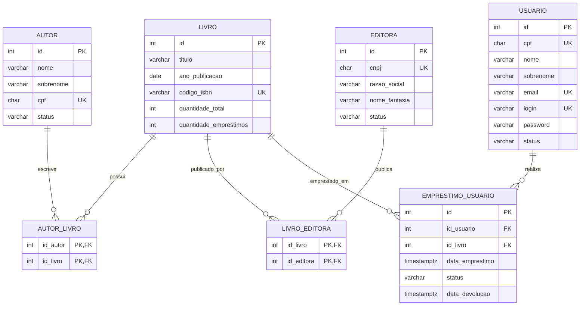

# Acervo CLI

Sistema de gerenciamento de biblioteca acadêmica executado no terminal. O projeto foi desenvolvido em Node.js com TypeScript e PostgreSQL, seguindo uma arquitetura em camadas para separar interface, regras de negócio e acesso ao banco de dados.

[Repositório no GitHub](https://github.com/VitorRP/sctec-projeto-final1)

## Sumário

- [Funcionalidades](#funcionalidades)
- [Tecnologias](#tecnologias)
- [Arquitetura](#arquitetura)
- [Modelagem do banco](#modelagem-do-banco)
- [Regras de negócio](#regras-de-negócio)
- [Como executar](#como-executar)
- [Dados iniciais](#dados-iniciais)
- [Exemplos de uso](#exemplos-de-uso)
- [Relatórios](#relatórios)
- [Qualidade e segurança](#qualidade-e-segurança)
- [Melhorias futuras](#melhorias-futuras)

## Funcionalidades

### Autenticação e usuários

- Login com usuário e senha.
- Cadastro de um usuário a partir da tela inicial.
- Cadastro, listagem, busca, atualização e desativação de usuários.
- Busca por ID, CPF, nome ou sobrenome.
- Remoção lógica por meio dos status `ativo` e `desativado`.
- Bloqueio de login e de novos empréstimos para usuários desativados.
- Bloqueio da desativação de usuários com empréstimos ativos.

### Autores e editoras

- Cadastro, listagem, busca, atualização e desativação.
- Busca de autores por ID, CPF, nome ou sobrenome.
- Busca de editoras por ID, CNPJ, razão social ou nome fantasia.
- CPF de autor e CNPJ de editora protegidos por restrições de unicidade.
- Registros desativados deixam de aparecer nas consultas operacionais.
- Vínculos antigos com livros são preservados após a desativação.

### Livros

- Cadastro com título, data de publicação e ISBN.
- Associação do livro a um autor e a uma editora durante o cadastro.
- Relacionamentos N:N preparados para que um livro possua mais autores ou editoras.
- Listagem e busca por ID, ISBN, título ou data de publicação.
- Adição e remoção de exemplares do acervo.
- Proteção contra a remoção de exemplares que estejam emprestados.
- Controle das quantidades total, emprestada e disponível.

### Empréstimos

- Criação e listagem de empréstimos.
- Devolução de livros.
- Validação da existência e do status do usuário.
- Validação da existência e da disponibilidade do livro.
- Bloqueio de empréstimos ativos duplicados para o mesmo usuário e livro.
- Atualização automática da quantidade de exemplares emprestados.
- Uso de transações para manter empréstimo, devolução e estoque consistentes.

### Relatórios

- Livros disponíveis.
- Livros emprestados.
- Livros cadastrados por autor.
- Quantidade de empréstimos por livro.
- Clientes com empréstimos ativos.
- Livros por editora.

## Tecnologias

| Tecnologia | Utilização |
|---|---|
| Node.js | Execução da aplicação CLI |
| TypeScript | Tipagem e organização do código |
| PostgreSQL 18 | Persistência e integridade dos dados |
| node-postgres (`pg`) | Pool de conexões e consultas parametrizadas |
| Docker e Docker Compose | Banco reproduzível em ambiente local |
| dotenv | Leitura das variáveis de ambiente |
| ESLint e Prettier | Qualidade e padronização do código |
| tsx | Execução do TypeScript em desenvolvimento |

## Arquitetura

O fluxo principal segue a sequência:

```text
View -> DTO -> Use Case -> Repository -> PostgreSQL
```

- **View:** apresenta menus, recebe dados e mostra resultados no terminal.
- **DTO:** organiza os dados recebidos pelos formulários.
- **Use Case:** contém validações e regras de negócio da operação.
- **Repository:** executa consultas SQL parametrizadas.
- **Model:** define os tipos usados entre as camadas.
- **main.ts:** cria as dependências e conecta os componentes da aplicação.

Estrutura principal:

```text
.
|-- postgres/
|   `-- docker-compose.yml
|-- sql/
|   |-- dml/
|   |   `-- init.sql
|   `-- seed.sql
|-- src/
|   |-- @common/
|   |   |-- database/
|   |   |-- errors/
|   |   |-- utils/
|   |   `-- view/
|   |-- infra/
|   |   `-- repositories/
|   |-- model/
|   |-- usecase/
|   |-- view/
|   |   `-- dto/
|   `-- main.ts
|-- package.json
|-- tsconfig.json
`-- README.md
```

As dependências são injetadas pelos construtores. Os repositories recebem o `Pool`, os use cases recebem repositories e as views recebem os use cases necessários.

## Modelagem do banco

O modelo possui relacionamentos N:N entre livros e autores e entre livros e editoras. Empréstimos relacionam usuários aos livros sem remover os registros históricos.



### Tabelas

| Tabela | Responsabilidade |
|---|---|
| `usuario` | Clientes e operadores que acessam o sistema |
| `autor` | Dados dos autores cadastrados |
| `editora` | Dados das editoras cadastradas |
| `livro` | Obras, ISBN e controle de exemplares |
| `autor_livro` | Associação N:N entre autores e livros |
| `livro_editora` | Associação N:N entre livros e editoras |
| `emprestimo_usuario` | Histórico de empréstimos e devoluções |

O script completo está em [`sql/dml/init.sql`](sql/dml/init.sql).

## Regras de negócio

1. Um livro somente pode ser emprestado quando há exemplar disponível.
2. O mesmo usuário não pode possuir dois empréstimos ativos do mesmo livro.
3. Usuários desativados não podem autenticar nem realizar novos empréstimos.
4. Usuários com empréstimos ativos não podem ser desativados.
5. Autores e editoras desativados não podem ser associados a novos livros.
6. A devolução altera o empréstimo para `devolvido`, registra a data e libera um exemplar.
7. A quantidade total de livros nunca pode ficar abaixo da quantidade emprestada.
8. Usuários, autores e editoras usam remoção lógica para preservar o histórico.
9. CPF, CNPJ, email, login e ISBN respeitam as restrições `UNIQUE` do banco.
10. O cadastro de livro e suas associações ocorre dentro de uma transação.

## Como executar

### Pré-requisitos

- Node.js 20 ou superior.
- npm.
- Docker Desktop com Docker Compose.
- Git.

### 1. Clonar o projeto

```bash
git clone https://github.com/VitorRP/sctec-projeto-final1.git
cd sctec-projeto-final1
```

### 2. Instalar as dependências

```bash
npm install
```

### 3. Configurar o ambiente

Crie um arquivo `.env` na raiz com:

```env
DEBUG=true
DB_PASSWORD=password123
DB_USER=admin
DB_HOST=localhost
DB_PORT=5432
DB_NAME=sctec
```

O arquivo `.env` contém dados locais e não deve ser enviado ao Git.

### 4. Iniciar o PostgreSQL

Na raiz do projeto:

```bash
docker compose -f postgres/docker-compose.yml up -d
```

Na primeira inicialização, o container executa os arquivos nesta ordem:

```text
sql/dml/init.sql -> cria tipos, tabelas e relacionamentos
sql/seed.sql     -> adiciona os dados de demonstração
```

Para acompanhar a inicialização:

```bash
docker logs -f sctec-db
```

Para recriar completamente o banco e executar o seed novamente:

```bash
docker compose -f postgres/docker-compose.yml down -v
docker compose -f postgres/docker-compose.yml up -d
```

> O parâmetro `-v` remove o volume e apaga os dados atuais do banco.

### 5. Iniciar a aplicação

Execução normal:

```bash
npm run start
```

Execução com reinício automático ao editar arquivos:

```bash
npm run start:dev
```

No modo de desenvolvimento, a mensagem `Waiting for file changes before restarting` significa que o observador está aguardando alterações. Use `Ctrl+C` para encerrá-lo.

Se o PowerShell bloquear `npm.ps1`, utilize os comandos equivalentes:

```powershell
npm.cmd install
npm.cmd run start
```

## Dados iniciais

O seed é idempotente e pode ser executado novamente sem duplicar cadastros e relacionamentos. Ele inclui:

- 11 autores;
- 6 editoras;
- 8 usuários;
- 15 livros;
- relacionamentos entre livros, autores e editoras;
- empréstimos ativos e devolvidos distribuídos em diferentes meses.

Credenciais para acesso inicial:

```text
login: admin
password: password123
```

O seed também sincroniza `livro.quantidade_emprestimos` com a quantidade real de empréstimos ativos.

## Exemplos de uso

### Login e menu principal

```text
========================================
   Bem-vindo ao Acervo CLI
   Sistema de Gestão de Biblioteca
========================================

Informe os dados de login
login: admin
password: password123

========================================
   Bem-vindo, Administrador do Sistema
   Sistema de Gestão de Biblioteca
========================================

1 - Autores
2 - Livros
3 - Editoras
4 - Empréstimos
5 - Usuários
6 - Relatórios
7 - Sair
```

### Cadastro de livro

```text
Informe os dados do livro, o ID do autor e o ID da editora
titulo: Novo Livro Acadêmico
ano_publicacao: 2026-01-01
codigo_isbn: 9781234567890
id_autor: 1
id_editora: 1

Livro cadastrado com sucesso!
```

O cadastro cria o registro em `livro` e os vínculos em `autor_livro` e `livro_editora`. Se uma etapa falhar, a transação desfaz toda a operação.

### Empréstimo

```text
Informe os dados do empréstimo
id_usuario: 2
id_livro: 1

Empréstimo cadastrado com sucesso!
```

### Devolução

```text
Informe o empréstimo que será devolvido
id: 1

Empréstimo devolvido com sucesso!
```

## Relatórios

Os relatórios demonstram consultas relacionais com `INNER JOIN`, `LEFT JOIN`, `GROUP BY`, `ORDER BY`, `LIMIT` e funções de agregação como `COUNT` e `STRING_AGG`.

| Relatório | Informação apresentada |
|---|---|
| Livros disponíveis | Quantidade disponível de cada livro |
| Livros emprestados | Livro, cliente e data dos empréstimos ativos |
| Livros por autor | Quantidade e títulos vinculados a cada autor |
| Empréstimos por livro | Quantidade histórica de empréstimos por obra |
| Clientes com empréstimos ativos | Clientes, quantidades e títulos emprestados |
| Livros por editora | Quantidade e títulos vinculados a cada editora |

Exemplo:

```text
========================================
Menu de Relatórios
========================================
1 - Livros disponíveis
2 - Livros emprestados
3 - Livros cadastrados por autor
4 - Quantidade de empréstimos por livro
5 - Clientes com empréstimos ativos
6 - Livros por editora
7 - Voltar ao Menu Principal
```

## Qualidade e segurança

- TypeScript configurado com `strict: true`.
- Consultas SQL parametrizadas com `$1`, `$2` e demais parâmetros.
- Pool de conexões do `pg` injetado nos repositories.
- Transações com `BEGIN`, `COMMIT` e `ROLLBACK` nas operações compostas.
- Bloqueio de linhas com `FOR UPDATE` durante operações concorrentes sensíveis.
- Restrições `PRIMARY KEY`, `FOREIGN KEY`, `UNIQUE` e `CHECK` no PostgreSQL.
- Seed reproduzível e protegido contra duplicações.
- Remoção lógica para preservar dados e relacionamentos.

Comandos de verificação:

```bash
npx tsc --noEmit
npm run lint
```

## Melhorias futuras

- Armazenar senhas com hash.
- Adicionar testes automatizados para empréstimos e devoluções.
- Permitir vários autores e editoras diretamente no formulário de cadastro.
- Criar reativação administrativa de usuários, autores e editoras.
- Adicionar paginação às listagens e relatórios.
- Melhorar a validação de CPF, CNPJ, email, ISBN e datas.

## Autor

Desenvolvido por [VitorRP](https://github.com/VitorRP) como projeto final do módulo de Desenvolvimento Back End Node.

## Licença

Este projeto utiliza a licença ISC, conforme definido no `package.json`.
